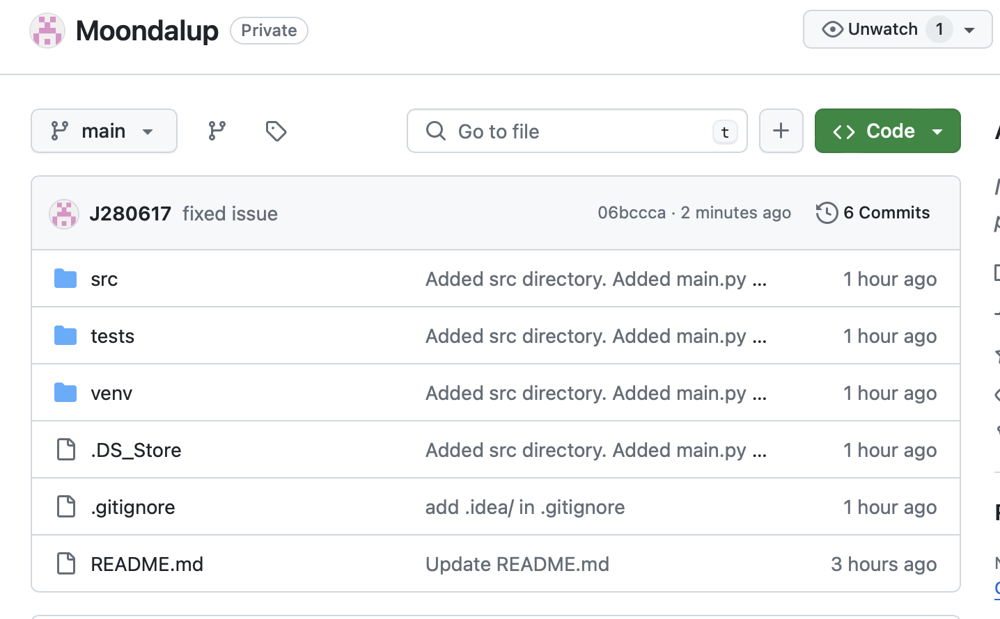
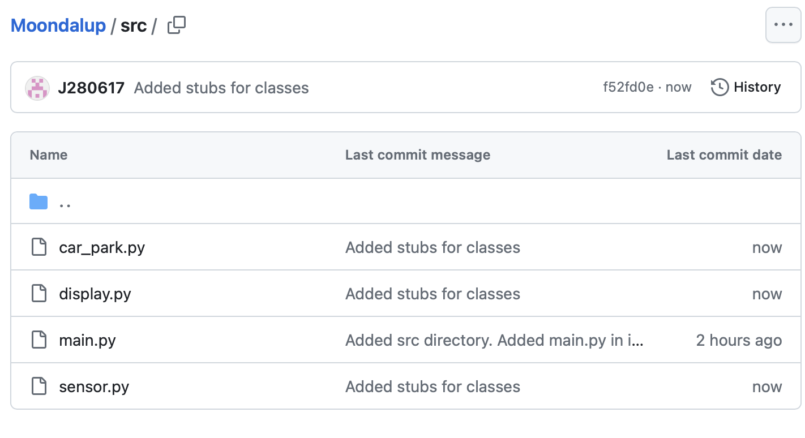
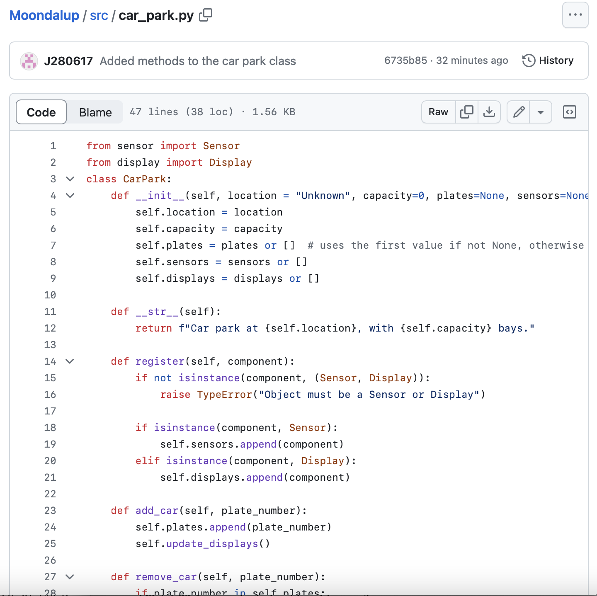
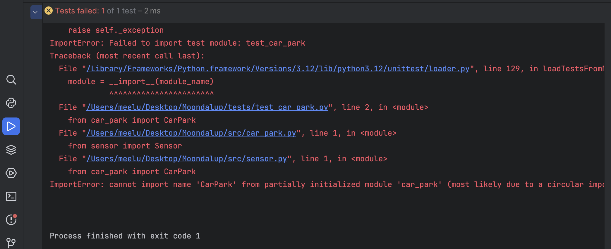
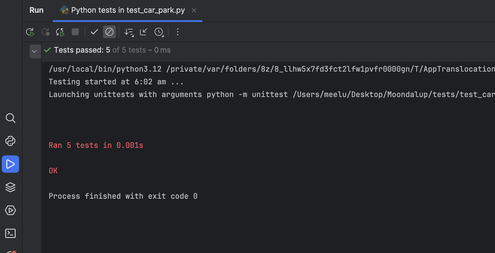
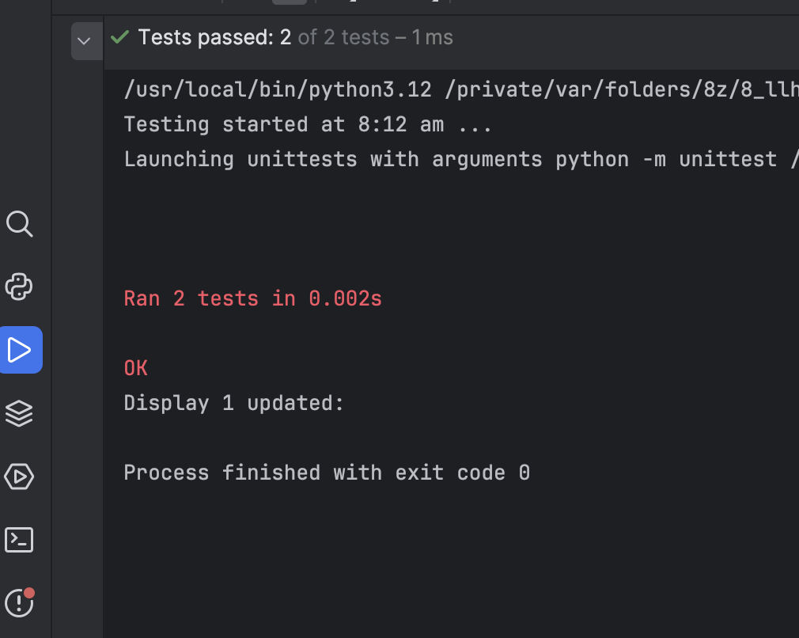
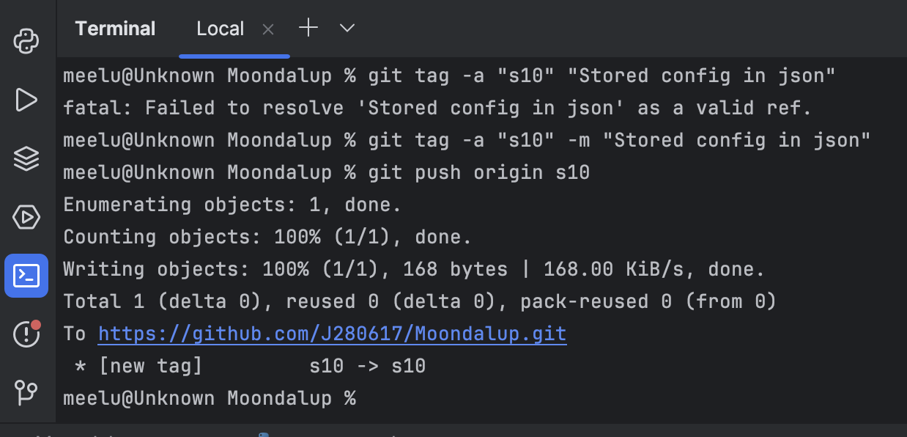
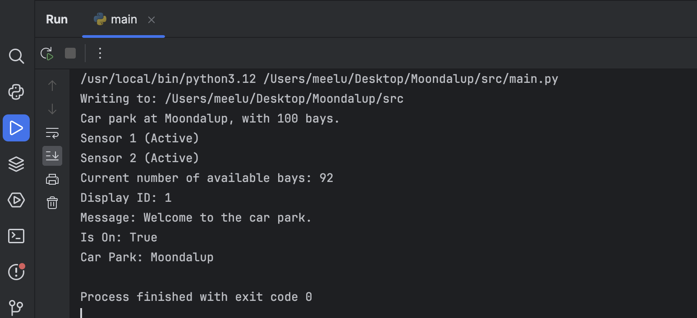
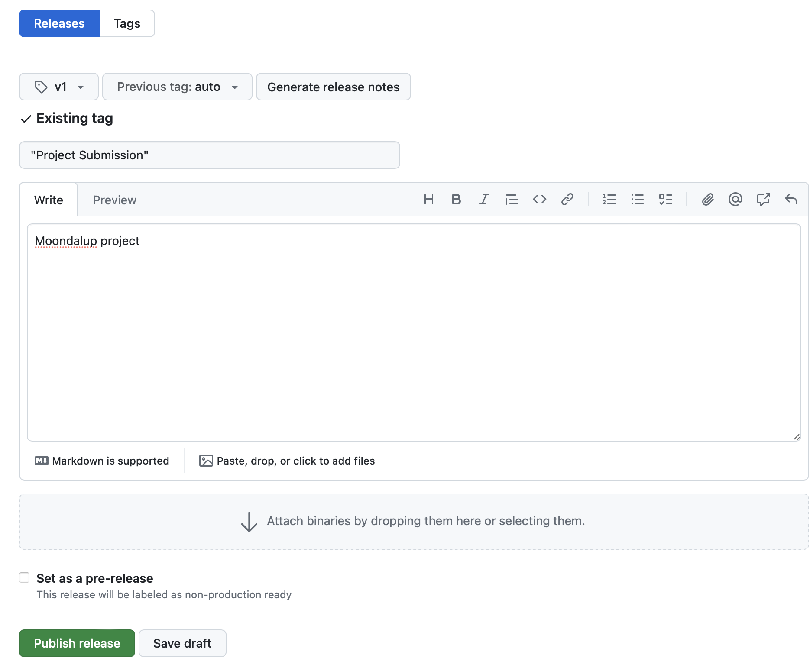
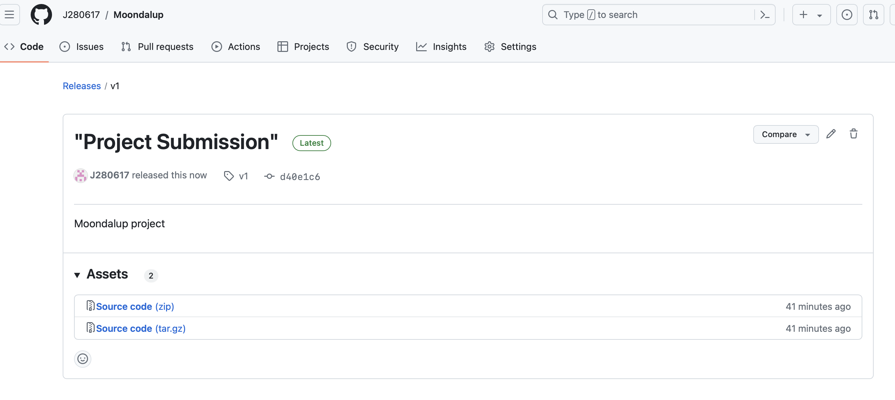

# Moondalup
you must design and implement a simplified car park system using Object-Oriented Programming (OOP) concepts in Python. The system will consist of a car park, sensors, and displays to track the cars entering and exiting and the availability of parking bays.

The system will be implemented in Python using the PyCharm IDE. You will use version control to manage your project and submit your work.

!

